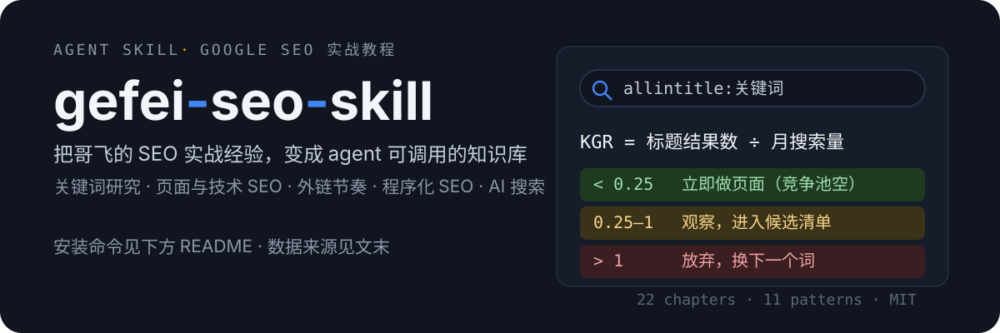

[English](README.md) · 简体中文

<p align="center">
  
</p>

# gefei-seo-skill

《Google SEO 实战教程》Agent Skill — 一个可被 AI 编程助手（Claude Code、Codex、OpenCode 等）加载的 SEO 知识库。

## 安装

```bash
npx skills add https://github.com/ifyour/gefei-seo-skill --skill gefei-seo
```

或手动安装：克隆本仓库，把 `gefei-seo/` 目录放入你的 skills 目录（`~/.agents/skills/`、`~/.claude/skills/`、项目内 `.claude/skills/` 等均可）。

## 知识结构

| 文件 | 内容 |
|---|---|
| `gefei-seo/SKILL.md` | 核心框架 + 章节/主题索引（入口） |
| `gefei-seo/chapters/` | 22 个章节提炼，按需加载 |
| `gefei-seo/glossary.md` | 关键术语表 |
| `gefei-seo/patterns.md` | 11 个可复用模式 |
| `gefei-seo/cheatsheet.md` | 决策速查（决策规则 / 硬数字 / 决策树） |

## 怎么用

安装后，agent 会在你讨论 SEO 话题时自动调用。三种加载粒度：

- **无参数** → 加载核心框架（排名三句话、KGR、发布节奏等）
- **带主题** → `KGR`、`外链`、`程序化SEO`、`惩罚恢复` …，读对应章节
- **带章节** → `ch09`、`ch16` …，直接加载章节文件
- **浏览** → 问"有哪些章节"，看索引

不需要记指令，直接用自然语言提问即可，例如：

```
帮我用 KGR 判断这个关键词值不值得做
新站前三个月外链该怎么发
这个工具站适合做程序化 SEO 吗
```

## 适用场景

**关键词研究**
- 评估一个关键词值不值得做：搜索量、竞争度、KGR 判断
- 新词/上升趋势词的挖掘与优先级排序
- 长尾词矩阵的搭建思路

**建站与页面优化**
- 新站的页面结构、TDH（Title/Description/Heading）写法
- SSR/SSG 选型、Core Web Vitals 达标
- 内容站 vs 工具站的差异打法

**外链与增长**
- 外链建设的节奏与安全边界（避免被惩罚）
- 程序化 SEO：什么项目适合、怎么避免 doorway pages
- 多语言 SEO 与 hreflang 配置

**AI 搜索时代**
- 面对 AI Overview / AI 搜索，内容如何被引用
- GSC/GA 数据的日常分析与异常排查

**救火**
- 流量骤降的排查路径
- 谷歌惩罚的判断与恢复流程

## 许可与数据来源

- 本仓库代码与整理内容以 **MIT** 许可发布。
- 知识内容来自 [Jayin/gefei-seo-cookbook](https://github.com/Jayin/gefei-seo-cookbook)。
- 书中数字（权重百分比、成本等）为写作时点数据，可能过期，请以 Google 官方文档与实时数据为准。
